# hello_world

A new Flutter project.

Praktikum 1

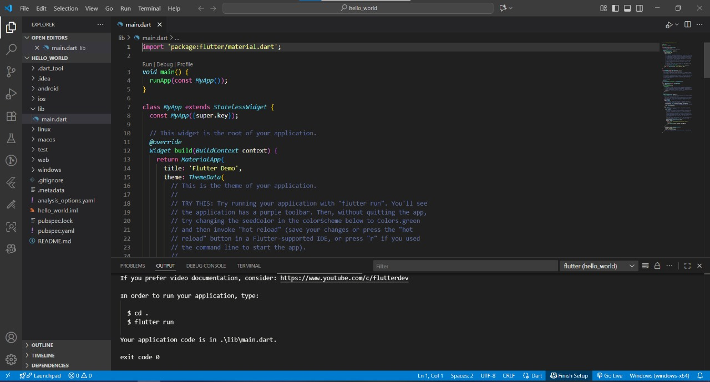

Praktikum 2

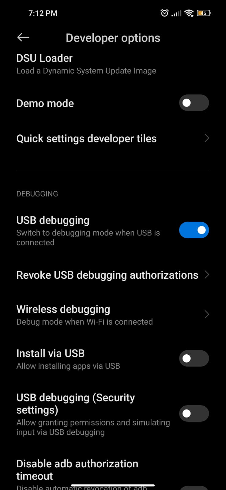

Praktikum 3

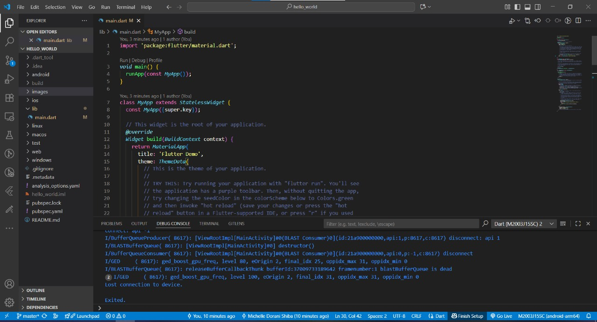

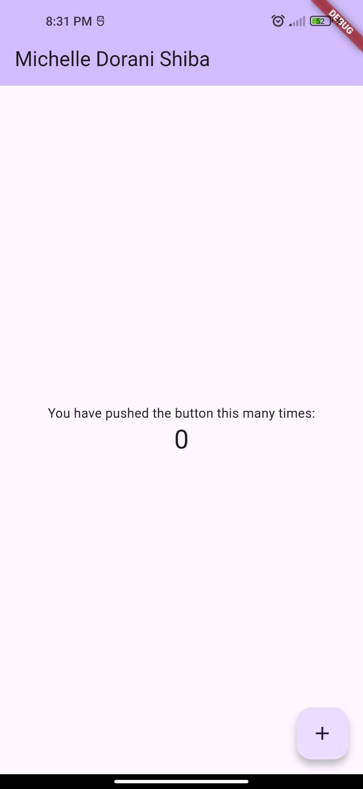

Praktikum 4
- Langkah 1

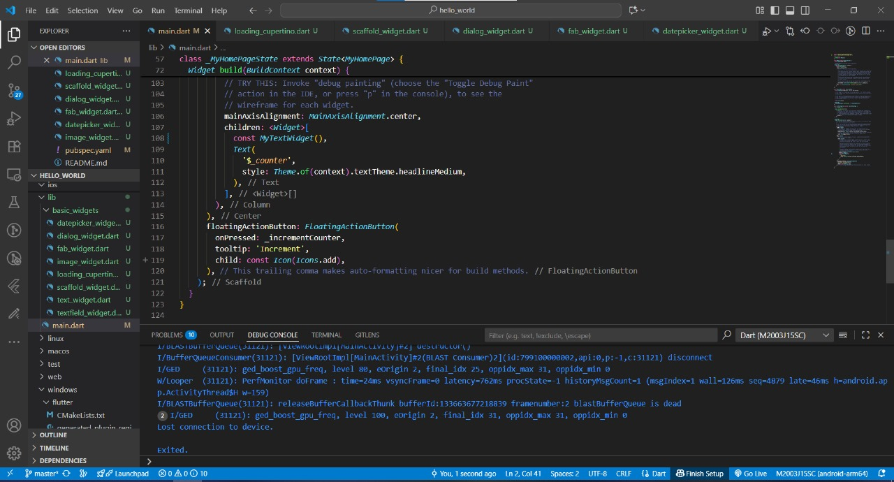

- Langkah 2

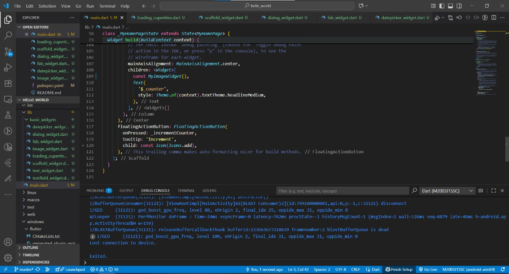

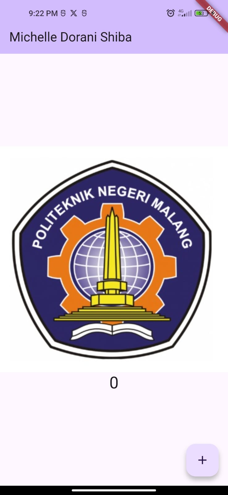

Praktikum 5

- Langkah 1

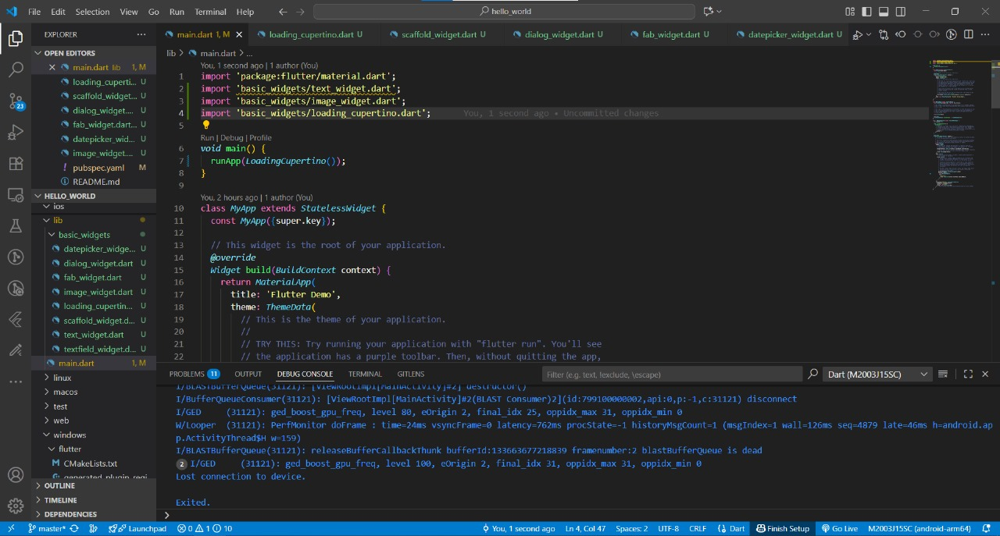

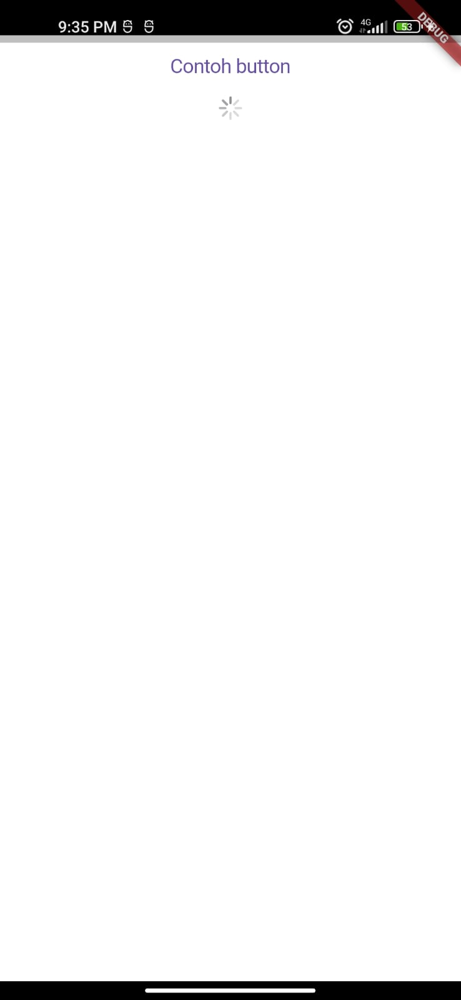

- Langkah 2

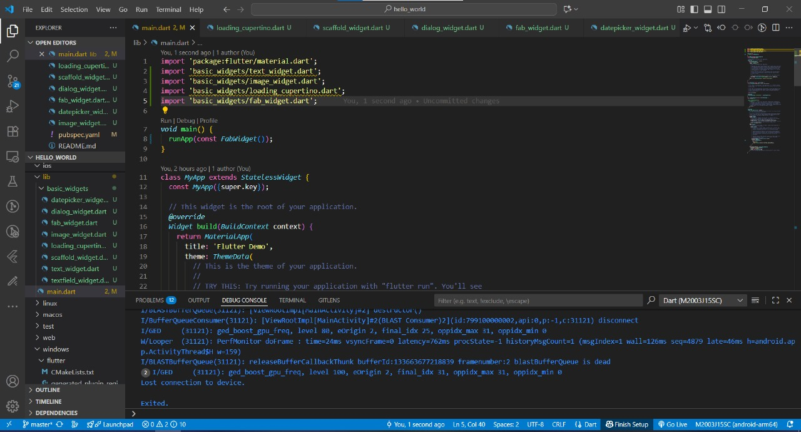

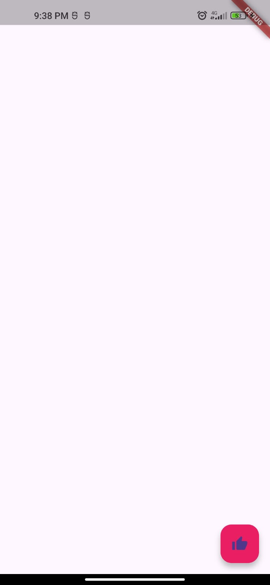

- Langkah 3

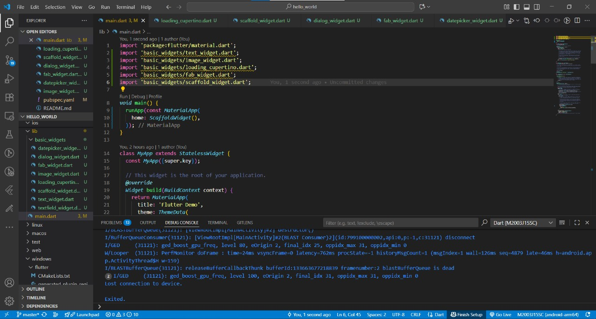

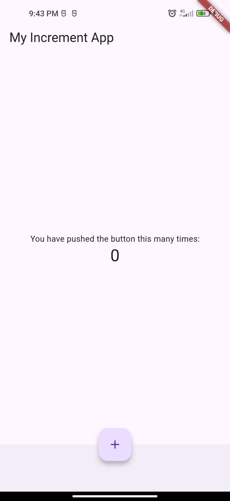

- Langkah 4

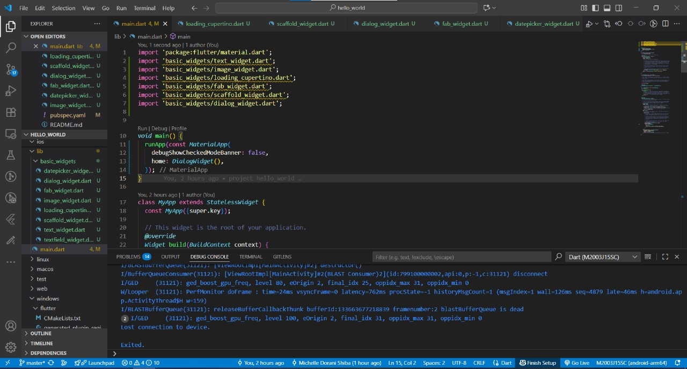

- Langkah 5

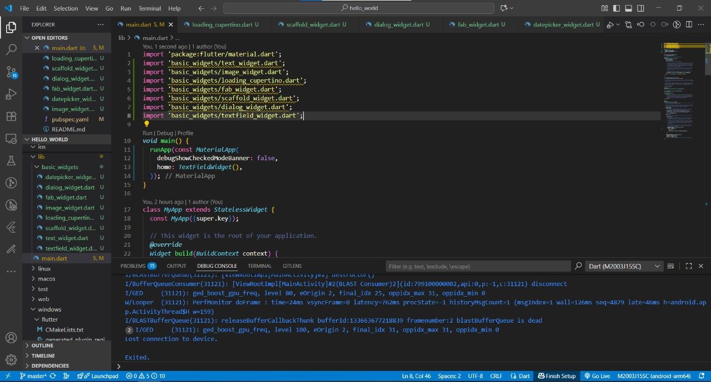

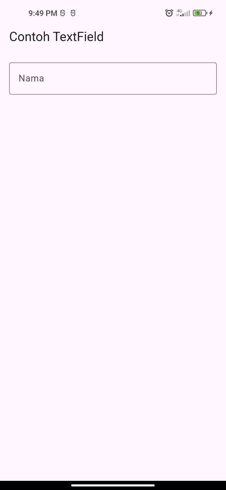

- Langkah 6

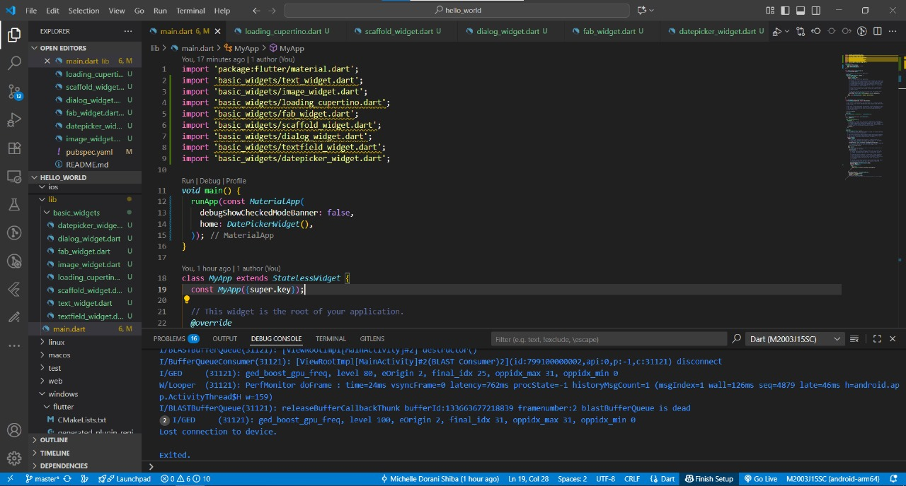

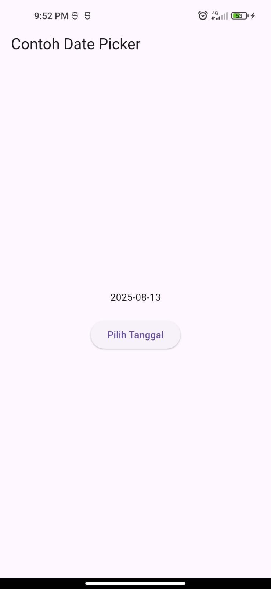

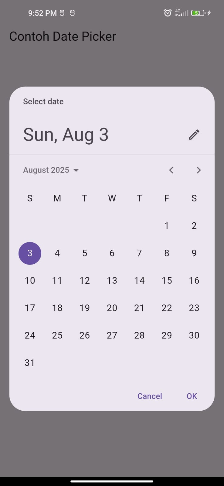

Tugas