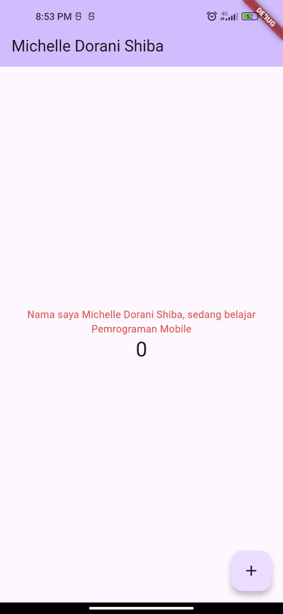
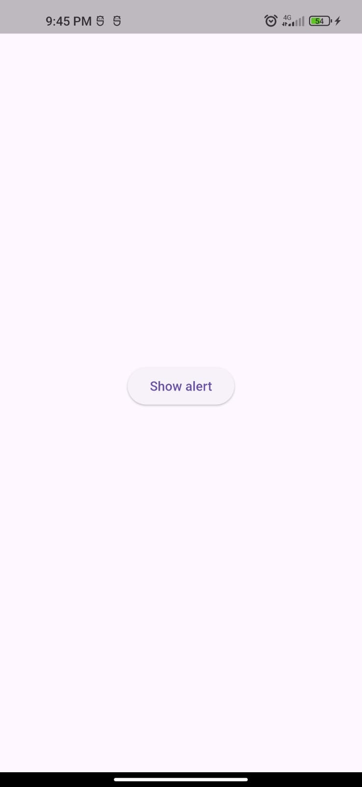

# hello_world

A new Flutter project.

Praktikum 1

Membuat project flutter baru dengan vsc

Praktikum 2

Menyambungkan perangkat android dengan kabel USB dan dimulai dengan memunculkan mode developer pada andoird

Praktikum 3

Membuat repo github, laporan praktikum, dan run projrct prtama 

Praktikum 4
- Langkah 1

Pada langkah pertama, kita membuat folder baru bernama basic_widgets di dalam folder lib untuk mengorganisir widget kustom. Selanjutnya, kita buat file text_widget.dart yang berisi sebuah StatelessWidget bernama MyTextWidget. Widget ini menampilkan teks sederhana dengan gaya warna merah dan ukuran font 14, serta teks diratakan ke tengah. Setelah selesai, file ini di-import ke dalam main.dart agar bisa dipanggil dan ditampilkan sebagai halaman utama aplikasi. Hasilnya, aplikasi akan menampilkan teks sesuai nama lengkap

- Langkah 2

Pada langkah kedua, kita membuat file baru bernama image_widget.dart di dalam folder basic_widgets. File ini berisi StatelessWidget bernama MyImageWidget yang menampilkan gambar menggunakan widget Image dengan sumber dari AssetImage. Agar gambar dapat muncul, kita harus menambahkan file gambar (misalnya logo_polinema.jpg) ke dalam folder assets pada project, kemudian melakukan penyesuaian di file pubspec.yaml dengan mendeklarasikan path aset tersebut. Dengan cara ini, Flutter dapat mengenali dan menampilkan gambar yang sudah ditambahkan ketika aplikasi dijalankan.

Praktikum 5

- Langkah 1

Pada langkah ini, dibuat file loading_cupertino.dart yang menampilkan contoh penggunaan widget dari framework Cupertino milik Flutter. Di dalamnya terdapat CupertinoButton yang berfungsi seperti tombol dengan gaya iOS, serta CupertinoActivityIndicator yang menampilkan animasi lingkaran berputar sebagai loading bar. Contoh ini memperlihatkan bagaimana Flutter dapat menggabungkan gaya antarmuka Android (Material) dan iOS (Cupertino) dalam satu aplikasi.

- Langkah 2

Floating Action Button adalah tombol melayang bundar khas Material Design yang biasa digunakan untuk aksi utama dalam sebuah halaman. Pada file fab_widget.dart, dibuat sebuah FAB dengan ikon jempol (Icons.thumb_up) dan warna dasar pink. Tombol ini dapat diklik dan dihubungkan dengan aksi tertentu melalui properti onPressed. Dengan cara ini, pengguna bisa menambahkan fungsi interaktif sesuai kebutuhan aplikasi.

- Langkah 3

Scaffold adalah layout utama di Flutter yang mendukung elemen-elemen Material Design seperti AppBar, FloatingActionButton, BottomAppBar, dan body konten. Pada contoh ini, Scaffold digunakan untuk membuat aplikasi penghitung sederhana (counter app) di mana setiap kali FAB ditekan, nilai angka bertambah. Selain itu, tata letak halaman juga ditampilkan dengan AppBar di atas, teks dan angka di tengah, serta BottomAppBar di bagian bawah.

- Langkah 4

Dialog adalah komponen yang digunakan untuk menampilkan pesan, peringatan, atau konfirmasi kepada pengguna. Flutter menyediakan dua jenis dialog utama, yaitu AlertDialog dan SimpleDialog. Pada contoh kode, ditampilkan AlertDialog dengan judul, isi pesan, dan tombol OK untuk menutup dialog. Pemanggilan dialog dilakukan menggunakan fungsi showDialog, yang memunculkan popup interaktif di tengah layar.

- Langkah 5

Input widget memungkinkan pengguna untuk memasukkan data ke aplikasi. Pada contoh ini digunakan TextField, sebuah kotak teks tempat pengguna bisa mengetik nama. Widget ini diberi dekorasi berupa OutlineInputBorder agar memiliki garis tepi, serta label teks "Nama". Dengan TextField, aplikasi dapat menerima input dari pengguna untuk kemudian diproses lebih lanjut.

- Langkah 6

Date Picker digunakan untuk memilih tanggal dengan antarmuka kalender. Pada contoh ini, sebuah aplikasi menampilkan tanggal saat ini dan menyediakan tombol untuk memilih tanggal baru menggunakan fungsi showDatePicker. Setelah pengguna memilih, tanggal yang dipilih akan ditampilkan di layar. Fitur ini sangat berguna untuk aplikasi yang membutuhkan input tanggal, seperti formulir, jadwal, atau pemesanan.